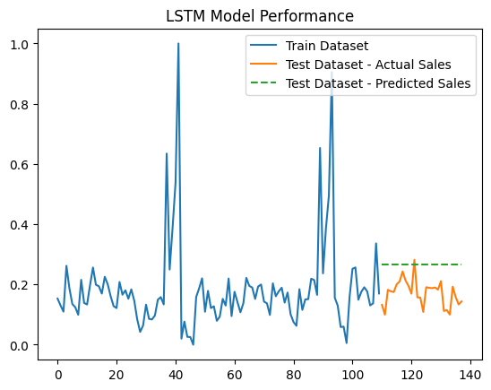

## About Data
This project based on https://www.kaggle.com/datasets/varsharam/walmart-sales-dataset-of-45stores

The file has information about the Weekly Sales of 45 stores for the year 2010-2012 including the factors affectors affecting Sales such as Holidays, Temperature, Fuel Price, CPI, and Unemployment.

1. Store: Store Numbers ranging from 1 to 45
2. Date: The Week of Sales. It is in the format of dd-mm-yyyy. The date starts from 05-02-2010
3. Weekly_Sales: The sales of the given store in the given week
4. Holiday_Flag: If the week has a special Holiday or not. 1-The week has a Holiday 0-Fully working week
5. TemperatureAverage: Temperature of the week of sales
6. Fuel_Price: Price of the Fuel in the region of the given store
7. Unemployment: Unemployment rate of the given store region
8. CPI: Customer Price Index , the instrument to measure inflation. It is used to estimate the average variation between two given periods in the prices of products consumed by households. It is a composite measurement of trends in the prices of products, at constant quality.

## Project Organization
    ├── configs
    │   └── feature_params      <- Configs for features
    │   └── model_params        <- Configs for model's hyperparameter
    │   └── path_config         <- Configs for input and output paths
    │   └── train_config.yaml   <- Config for train pipline
    │ 
    ├── data
    │   └── raw            <- The original dataset
    │
    ├── notebooks          <- Jupyter notebooks
    │                        
    ├── outputs            <- Hydra log
    │
    ├── src                <- Source code for use in this project.
    │   ├── __init__.py    <- Makes src a Python module
    │   │
    │   ├── entities       <- Scripts for creating dataclasses
    │   │
    │   ├── features       <- Scripts to turn raw data into features for modeling
    │   │   └── features_process.py
    │   │
    │   ├── models         <- Scripts to train and serialized models (LSTM)
    │   │   ├── metrics    <- output metrics dir
    │   │   └── saved_models <- saved model dir
    │   │   └── build_model.py <-Script to build LSTM model
    │   │   
    │   ├──  utils        <- Scripts for loading data, saving artifacts, checking time-series data stationarity and other func
    │   |    └── utils.py
    |   |
    |   └── train.py     <- pipeline for model training
    |
    ├── tests              <- tests for the project
    |
    ├── setup.py           <- makes project pip installable (pip install -e .) so src can be imported
    |
    ├── requirements.txt   <- The requirements file for reproducing the analysis environment, e.g.
    │                         generated with `pip freeze > requirements.txt`
    ├── .flake8            <- Coding style
    |
    ├── README.md          <- The top-level README for developers using this project.

### Model Summary - LSTM


### Model Performance



## For Developers
Here is the instruction with venv setup
```sh
# create a virtual environment
$ conda create -y --name=venv_name python=3.10.12
# activate it
$ conda activate venv_name
# upgrade your pip installation
pip install --upgrade pip
# install required libraries for production
pip install -r requirements.txt
```

Configs required

    ├── configs
    │   └── feature_params
    │   │   └── features.yaml   <- Config for feature description
    │   │
    │   ├── path_config           
    │   │   └── path_config.yaml <- Config with all paths: data, models, etc
    │   │
    │   ├── model_params
    |   |   └── lstm.yaml          <- Config for a model (lstm)
    │   │
    │   ├── train_config.yaml      <- Config for train_pipline for Hydra

How to train your model
```sh
# create a virtual environment
$ python src/train.py
```

